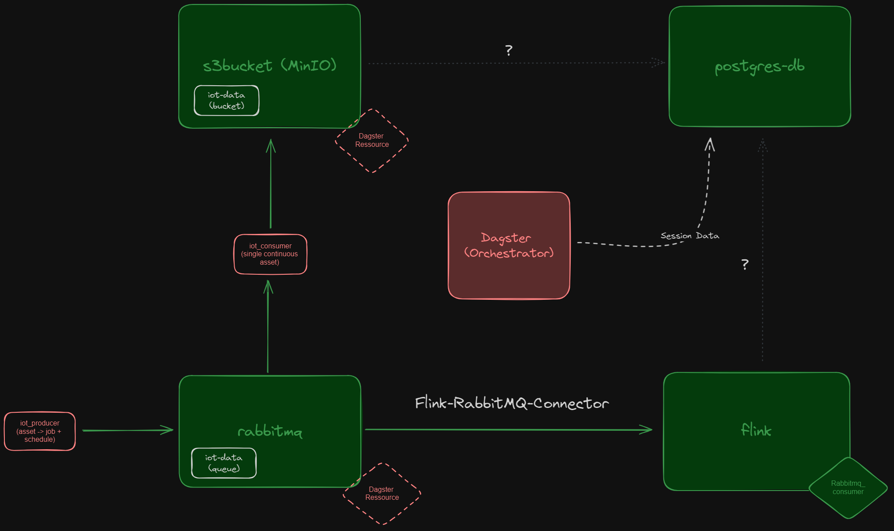

# Local UDP Testing
Plattform to localy test components and processes for development of the UDP in a containerized environment.

## Current State



### Connected Services

1. Python Script as IOT-Producer (Docker Container)
2. RabbitMQ Message Broker (currently only one queue calles "iot-data")
3. Python File as iot-Consumer (Docker Container)
4. Minio as S3 bucket Service (currently only 1 bucket called "iot-data")

### Unconnected services
- postgres db
- Flink (Real Time Analytics)
  - Task Manager
  - Job-Manager
- Dagster as Orchestration Service

### Open questions
- How to deploy consumers and producers for RabbitMQ? Current solution with a designated docker container, can´t be the final solution.
- Can dagster be used to establish rabbit mq and s3_bucket connection?
- How to connect RabbitMQ iot-data queue to flink?
- How to connect s3_bucket with postgresdb?
- How to connect flink with postgres? 

## Prerequisits

- Docker Desktop

Check if installed and ready

```bash
docker -v
```

- Docker Compose (Automaticaly installed with latest Docker Desktop Version)

Check if installed and ready

```bash
docker-compose -v
```

## Getting started

Create .env file to set your secrets. See [.env.example](./.env.example).

```plain
MINIO_ROOT_USER=***YOUR_USERNAME HERE- Min 3 Chars***
MINIO_ROOT_PASSWORD=***YOUR_PASSWORD HERE- Min 8 chars***

POSTGRES_USER=***YOUR POSTGRES USER HERE***
POSTGRES_PASSWORD=***YOUR POSTGRES PASWORD HERE***
POSTGRES_DB=***YOUR POSTGRES DB HERE***

MINIO_ACCESS_KEY=***YOUR ACCESS_KEY HERE***
MINIO_SECRET_KEY=***YOUR MINIO_SECRET_KEY HERE***

RABBITMQ_DEFAULT_USER=***YOUR RABBITMQ_DEFAULT_USER HERE - can be anything eg. `guest`***
RABBITMQ_DEFAULT_PASS=***YOUR RABBITMQ_DEFAULT_PASS HERE - can be anything eg. `guest`***
```

## Run Container

1. Make Sure Docker Desktop is up and running
2. Start the container with docker-compose

```bash
docker compose up -d
```

Use the --build flag if you want rebuild the container without caching.

```bash
docker compose up -d --build
```

### Port Mapping Services

- MinIO UI [localhost:9001](http://localhost:9001)
- MinIO API [localhost:9000](http://localhost:9000)
- PostgresDB [localhost:5432](http://localhost:5432)
- RabbitMQ messaging [localhost:5672](http://localhost:5672)
- RabbitMQ management UI [localhost:15672](http://localhost:15672)
- Flink UI [localhost:8081](http://localhost:8081)
- Dagster UI [localhost:3000](http://localhost:3000)

## Usage

### MinIO

MinIO is used to create a local S3-Bucket service. Got to the [MinIO-UI](http://localhost:9001) and login with the credentials (MINIO_ROOT_USER, MINIO_ROOT_PASSWORD) set in your [.env](./.env) file.

You can manualy add new buckets or create access keys, users and user-roles.

### RabbitMQ

Acces the [RabbitMQ-UI here](http://localhost:15672).

### PostgresDB

Use Database-Management-Tool (eg. PGAdmin) to connect to the Databese. Use connection settings set in your [.env](./.env) file.

### Flink UI

Acces the [Flink-UI here](http://localhost:8081).

### Dagster

Access the [Dagster UI here](http://localhost:3000). Use Dagster to orchestrate your data pipelines.
